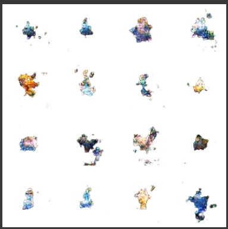
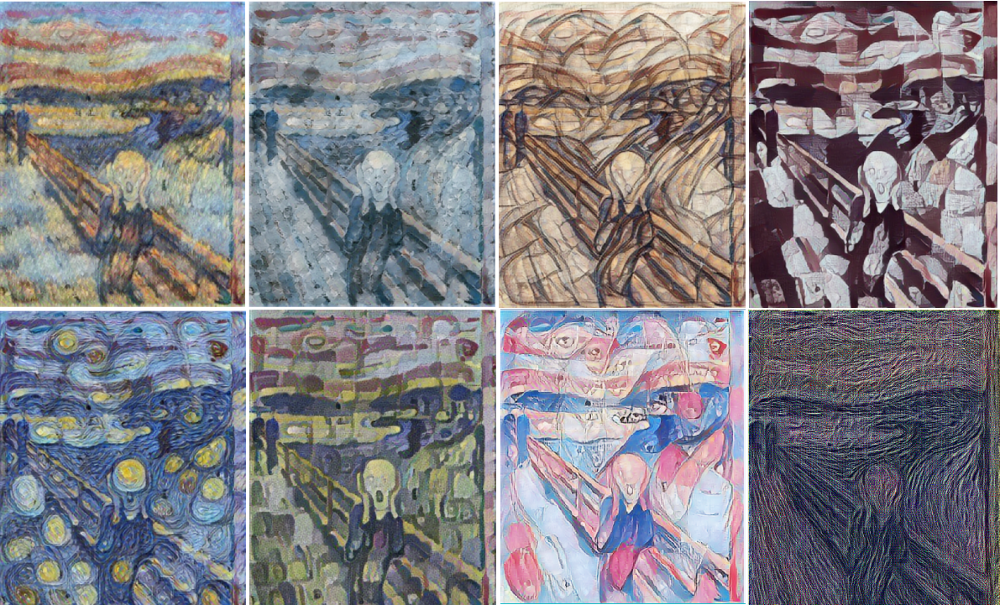

### [Classification](https://github.com/AllanKamimura/AI/tree/master/image/classification)

### [Segmentation](https://github.com/AllanKamimura/AI/tree/master/image/semantic_segmentation)

### [Detection](https://github.com/AllanKamimura/AI/tree/master/image/object_detection)

### [GAN](https://github.com/AllanKamimura/AI/tree/master/image/GAN)

### [Style](https://github.com/AllanKamimura/AI/tree/master/image/style_transfer)
